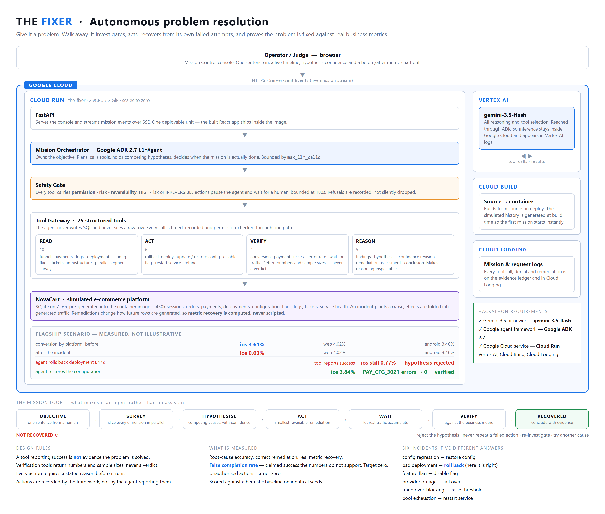

# The Fixer

**Give it a problem. Walk away.**

An autonomous operations agent that investigates a problem it was not told the answer
to, applies a fix, recovers when its own first attempt fails, and proves against real
business metrics that the problem is actually solved.

Built for the **All Things Agentic Hackathon** — Taskmaster track.

| requirement | what this project uses |
|---|---|
| Gemini 3.5 or newer | **`gemini-3.5-flash`** via Vertex AI |
| Google agent framework | **Google ADK 2.7** (`google-adk`, `LlmAgent`) |
| Google Cloud service | **Cloud Run**, plus Vertex AI, Cloud Build, Cloud Logging |



---

## What makes it an agent and not an assistant

Most AI tells you what is wrong. This takes responsibility for the outcome.

The user types one sentence:

> *"Our conversion rate has dropped significantly today. Find out why and fix the problem."*

Then walks away. The agent:

1. **Surveys** — slices conversion by platform, region, traffic source and app version
   concurrently, to find which slice of traffic is actually affected.
2. **Investigates** — reads payment failures, error logs, deployments, configuration
   history, feature flags, support tickets and service health.
3. **Hypothesises** — records competing explanations with explicit confidence.
4. **Acts** — applies the smallest reversible remediation it believes in, stating why.
5. **Waits** — lets real traffic accumulate. A fix only affects sessions served after it.
6. **Verifies** — checks the actual business metric, not whether its tool call returned 200.
7. **Recovers** — if the metric did not move, it says so plainly, rejects that hypothesis,
   and investigates further rather than declaring victory.

### The moment that matters

In the flagship scenario, the agent finds a deployment that shipped 37 minutes before the
symptoms began. Rolling it back is a sound first hypothesis, and the rollback genuinely
succeeds.

Conversion does not recover.

That failure is not scripted. Runtime configuration is versioned separately from
deployments — as it is in real systems — so the deployment's release script wrote a
config change that a rollback cannot revert. The agent sees the metric refuse to move,
rejects its hypothesis, finds the real cause, and fixes that.

```
ios conversion   3.61%  ->  0.63%          web 4.02%, android 3.46%  (untouched)
  rollback deployment 8472   -> tool reports success, ios stays 0.77%
  restore the config         -> ios 3.84%, PAY_CFG_3021 errors drop to 0
```

---

## Running it

### Try the hosted version

*(Deployed URL — see the Devpost submission. No login required.)*

Pick a scenario, click **START MISSION**, and watch. Nothing is pre-recorded; the agent
is querying a live database and the numbers on the chart come from rows it is really
reading.

### Run it locally

Requires **Python 3.12** and **Node 20**. Takes about five minutes, most of which is
generating the simulated company.

```bash
git clone <this repo> && cd the-fixer

# 1. Python environment  (uv is used here; plain venv + pip works identically)
uv venv --python 3.12
uv sync

# 2. Frontend
cd frontend && npm ci && npm run build && cd ..

# 3. Credentials — either Vertex AI (preferred) or a Gemini API key.
cp .env.example .env
#   Vertex AI:      GOOGLE_GENAI_USE_VERTEXAI=1
#                   GOOGLE_CLOUD_PROJECT=your-project
#                   GOOGLE_CLOUD_LOCATION=us-central1
#                   ...then: gcloud auth application-default login
#   Gemini API key: GOOGLE_API_KEY=...   (from aistudio.google.com/apikey)

# 4. Run
PYTHONPATH=backend .venv/bin/python -m uvicorn fixer.api.app:app --port 8080
#   Windows: PYTHONPATH=backend .venv/Scripts/python.exe -m uvicorn fixer.api.app:app --port 8080
```

Open **http://127.0.0.1:8080**.

The first mission generates a day and a bit of NovaCart history (~40s). It is cached
after that, and subsequent missions start in about three seconds. To pre-generate:

```bash
.venv/bin/python scripts/prebuild_cache.py --seeds 4242
```

**No credentials?** Everything still runs. The console falls back to a deterministic
heuristic agent, which drives the same tools, the same world and the same mission state
as the model does. `GET /api/health` reports which one is active.

### Run one mission in the terminal

```bash
.venv/bin/python scripts/run_mission.py --incident payment_config_regression
```

### Reproduce the evaluation

```bash
.venv/bin/python scripts/evaluate.py --agent llm    --runs 2   # needs credentials
.venv/bin/python scripts/evaluate.py --agent oracle --runs 2   # baseline, no credentials
```

### Deploy to Cloud Run

Builds with Cloud Build, so no local Docker daemon is needed.

```bash
PROJECT=your-project ./scripts/deploy.sh
```

---

## How it is kept honest

This is a project about an agent claiming to have fixed something. The obvious failure
mode is an agent that says it succeeded when it did not, so most of the design effort
went into making that impossible to fake.

**Recovery is computed, never scripted.** An incident plants a *cause* — a config value,
a deployment, a flag — and the traffic generator folds that cause's effects into every
row it produces. When the agent changes something, the generator recomputes what is still
true and later rows come out different. A correct fix makes the metric genuinely recover.
A wrong one genuinely does not.

**Verification tools return no verdict.** No field in any result says "solved". They
return a rate, the sample size behind it, and a comparison against a stable three-hour
baseline. The agent has to decide, and it can be wrong.

**Actions are recorded by the framework, not by the agent.** What happened must not depend
on the agent choosing to be honest about it.

**Six incidents, five different correct answers.** If every answer were "restore the
config", an agent could score well by pattern-matching this environment rather than by
reasoning. `bad_deployment` is deliberately the mirror image of the flagship scenario:
there, rolling back the deployment *is* the fix.

| incident | discriminated by | correct fix |
|---|---|---|
| payment config regression | platform + error code | restore configuration |
| bad deployment | platform + service errors | **roll back the deployment** |
| feature flag mistake | funnel stage — *no failed payments at all* | disable the flag |
| provider degradation | error code — *nothing changed on our side* | fail over |
| fraud over-blocking | **region** — invisible to a platform split | raise the threshold |
| connection pool exhaustion | even everywhere — *only latency shows it* | restart the service |

**The grader is outside the agent** and reads the world directly. It measures recovery on
every segment the incident actually touches, not just the aggregate — an incident confined
to two regions can leave them at a quarter of normal conversion while the overall number
still looks acceptable.

### Measured results

Scored on identical seeds, so the comparison is like for like.

```
scripts/evaluate.py --agent oracle --runs 2      12 missions across 6 incidents

  clean runs                       50.0%
  root-cause accuracy              50.0%
  correct remediation              50.0%
  false completion                  0.0%     <- must be zero
  unauthorised actions                 0     <- must be zero
```

The heuristic baseline exists so that the model's number means something. "Solved 9 of
10" says little on its own; "solved 9 of 10 where a reasonable heuristic solves 3" is a
claim about reasoning. The baseline reliably solves the incidents that yield to
segment-then-look-at-what-changed, and reliably fails the three that need actual inference.

*(LLM results are added here once measured — this README quotes only numbers that came
out of a real run.)*

---

## Safety

The agent has real actions available, including one that moves money. It cannot use that
one alone.

Every tool carries **permission**, **risk** and **reversibility**. Anything HIGH-risk or
IRREVERSIBLE pauses the agent mid-action and waits for a human, showing the action, its
risk, whether it can be undone, and the agent's own stated reason for wanting it. The wait
is bounded at 180 seconds — an agent blocked forever on a dialog nobody is watching is a
hang, not a safety feature — after which the action is refused and the agent continues
without it or ends the mission as `REQUIRES_HUMAN`.

This is verified against the database rather than against the agent's report: after a
denied refund, zero orders are refunded and the failed-order count is unchanged.

Missions terminate in one of seven states: `SUCCESS`, `FAILED`, `BLOCKED`,
`REQUIRES_HUMAN`, `INSUFFICIENT_EVIDENCE`, `TIMEOUT`, `SAFETY_LIMIT`.

---

## What is simulated, and why

NovaCart — the e-commerce company the agent operates — is simulated. That is a deliberate
choice, not a shortcut.

An agent that takes real remediations against a real production system cannot be evaluated:
you cannot run the same incident two hundred times, you cannot know the ground-truth root
cause, and you certainly cannot let it be wrong. The simulator makes the agent *measurable*.
Every number in this README came from running missions against incidents with known causes
and checking what actually happened.

What is **not** simulated: the agent, the reasoning, the tool calls, the failures, the
recovery, and the metrics it is judged on. Those are real, and the agent has no access to
the ground truth.

---

## Repository layout

```
backend/fixer/
  sim/          NovaCart: schema, incident definitions, traffic generator, world clock
  tools/        the 25 tools, safety metadata, evidence ledger
  agent/        ADK agent, prompts, model config, deterministic baseline
  evaluation/   grading against ground truth
  api/          FastAPI, SSE streaming, mission sessions, approval gate
  mission.py    mission state: hypotheses, findings, actions, verifications
frontend/       Mission Control console (React, no chart library)
scripts/        gates, evaluation, deploy, diagram and screenshot rendering
docs/           architecture diagram, plan and running log
```

### Tests and gates

Each is a runnable script that checks a specific property, not a unit-test suite.

```bash
.venv/bin/python scripts/smoke_day1.py          # the simulator's causality holds
.venv/bin/python scripts/smoke_day2.py          # the tool layer and its ADK schemas
.venv/bin/python scripts/smoke_day3.py          # mission pipeline, and the grader catches a lie
.venv/bin/python scripts/smoke_day7.py          # safety gate and parallelism
.venv/bin/python scripts/validate_incidents.py  # every incident: symptom real, decoy fails, fix works
```
